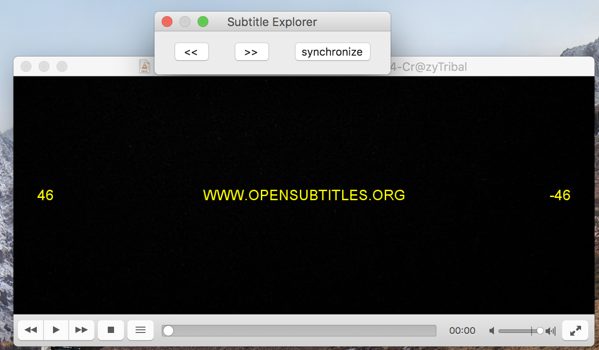

# vlc-subtitle-explorer
Addon for the vlc player that allows you to browse freely through the subtitles of a video and synchronize the caption with the paused moment in the video.

## Code
inspired by another name addon: say-it-again: https://addons.videolan.org/content/show.php/Say+It+Again?content=157180

